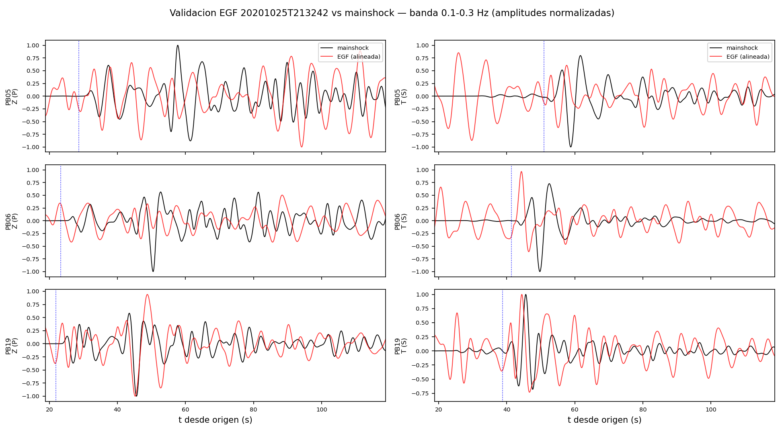
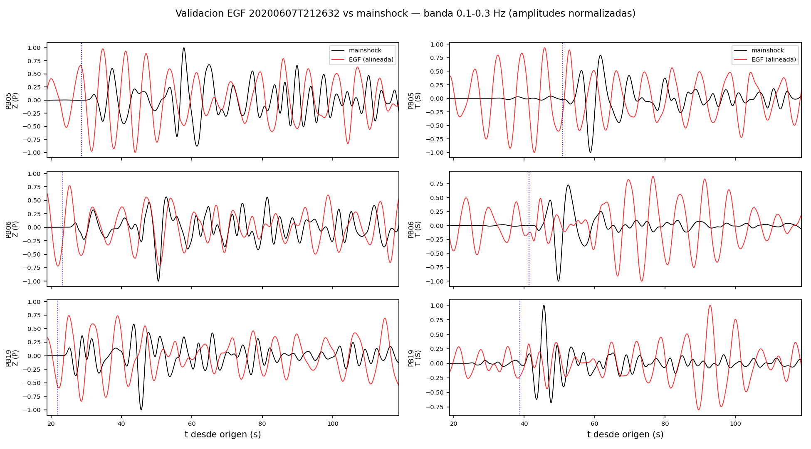
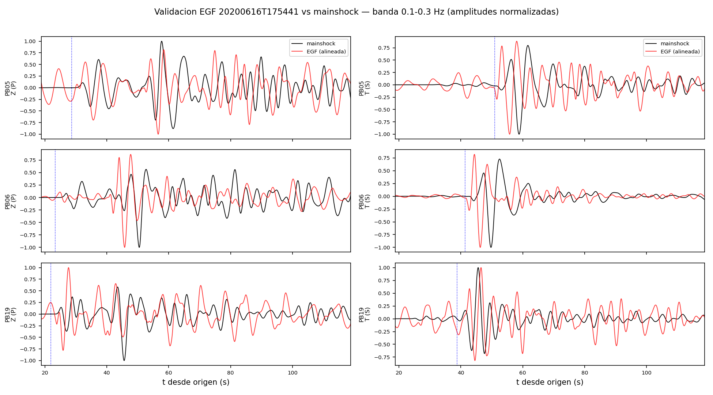

## Candidato 20201025T213242  (M4.6, dM=2.2, d3D=5.5 km)

Banda 0.1-0.3 Hz. Mainshock local (accel->vel) vs EGF (respuesta removida a VEL), mismo filtro causal.

| sta | dist (km) | SNR_P egf | CC_P (Z) | lag | CC_S (T) | lag |
|-----|-----------|-----------|----------|-----|----------|-----|
| PB05 | 176.9 | 1.2 | 0.68 | -6.2 | 0.67 | 3.9 |
| PB06 | 122.5 | 0.7 | 0.53 | 2.2 | 0.6 | 9.1 |
| PB19 | 106.4 | 1.3 | 0.63 | 0.8 | 0.54 | 1.1 |

**CC_S mediana = 0.60 -> VALIDA (CC_S mediana >= 0.6)**

## Candidato 20200607T212632  (M4.0, dM=2.8, d3D=3.6 km)

Banda 0.1-0.3 Hz. Mainshock local (accel->vel) vs EGF (respuesta removida a VEL), mismo filtro causal.

| sta | dist (km) | SNR_P egf | CC_P (Z) | lag | CC_S (T) | lag |
|-----|-----------|-----------|----------|-----|----------|-----|
| PB05 | 176.9 | 2.1 | 0.59 | -9.4 | 0.49 | -4.1 |
| PB06 | 122.5 | 1.0 | 0.64 | 0.6 | 0.45 | -9.6 |
| PB19 | 106.4 | 1.2 | 0.46 | 4.5 | 0.43 | 4.6 |

**CC_S mediana = 0.45 -> MARGINAL (0.4 <= CC_S < 0.6)**

## Candidato 20200616T175441  (M4.89, dM=1.91, d3D=17.7 km)

Banda 0.1-0.3 Hz. Mainshock local (accel->vel) vs EGF (respuesta removida a VEL), mismo filtro causal.

| sta | dist (km) | SNR_P egf | CC_P (Z) | lag | CC_S (T) | lag |
|-----|-----------|-----------|----------|-----|----------|-----|
| PB05 | 176.9 | 1.6 | 0.78 | -1.2 | 0.66 | 3.3 |
| PB06 | 122.5 | 3.0 | 0.54 | -0.1 | 0.77 | 3.5 |
| PB19 | 106.4 | 2.7 | 0.57 | 0.8 | 0.81 | -0.9 |

**CC_S mediana = 0.77 -> VALIDA (CC_S mediana >= 0.6)**

