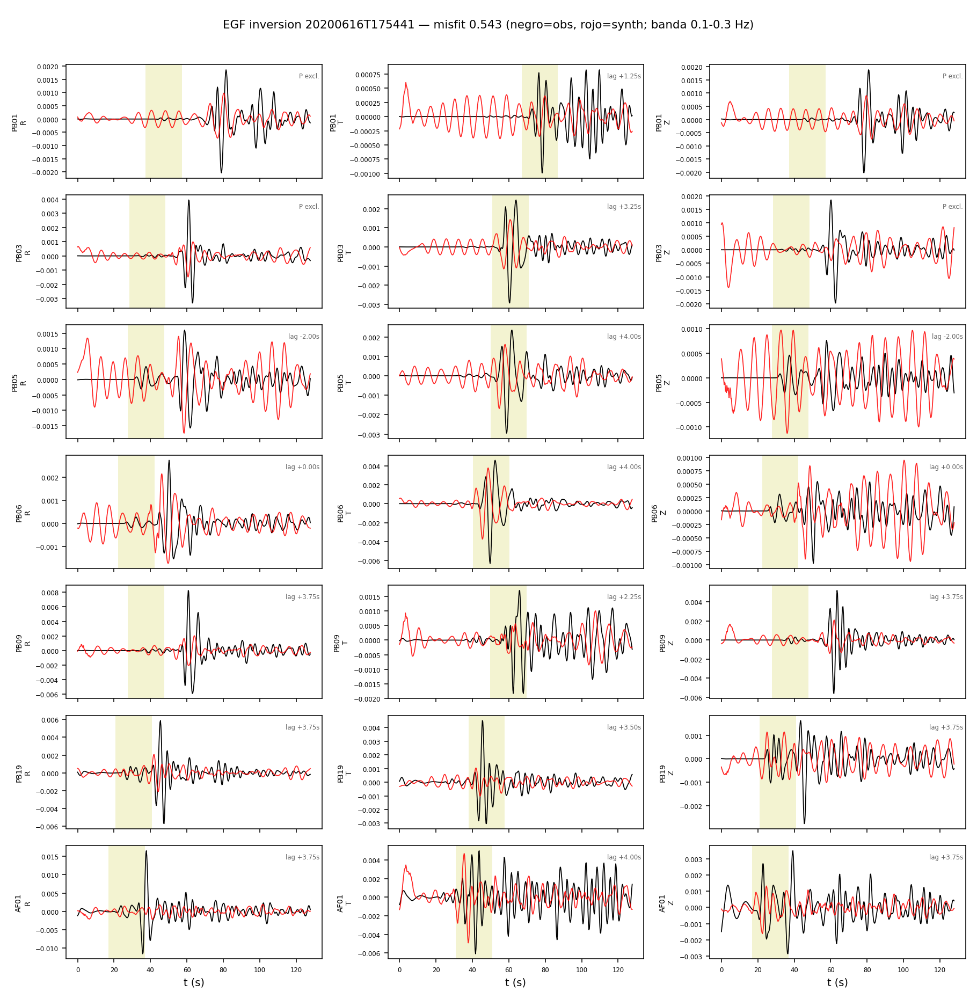
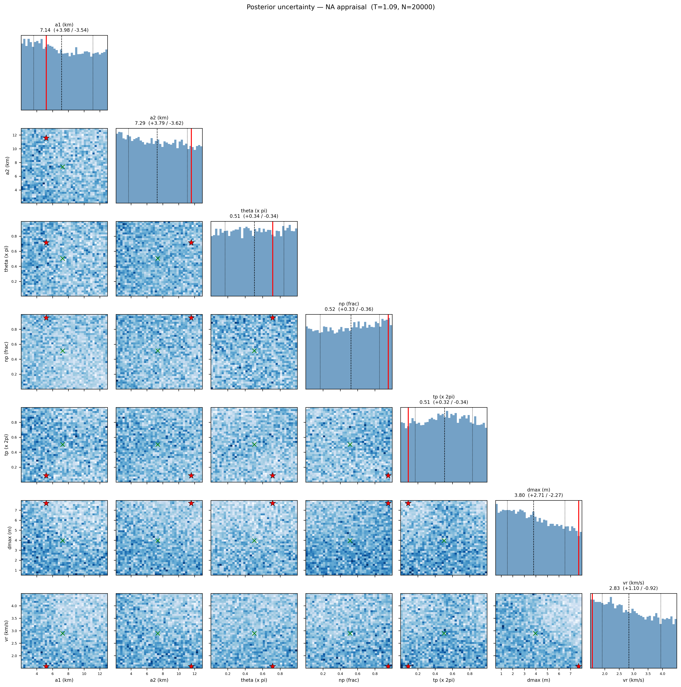

# Inversion EGF — Calama 2020 (banda 0.1-0.3 Hz)

EGF: 20200616T175441 M4.89 (M0_egf=2.43e+16 Nm, de Mw catalogo).
Estaciones (7): PB01, PB03, PB05, PB06, PB09, PB19, AF01

**Mejor misfit: 0.5431**  (M0=7.21e+19 Nm, Mw=7.21)

| param | valor |
|---|---|
| a1 (km) | 5.194 |
| a2 (km) | 11.576 |
| theta (x pi) | 0.715 |
| np (frac) | 0.954 |
| tp (x 2pi) | 0.088 |
| dmax (m) | 7.697 |
| vr (km/s) | 1.568 |
Lags estaticos (max +-4.0 s) del mejor modelo; ventanas P excluidas: PB01, PB03

| sta | lag P (s) | lag S (s) |
|---|---|---|
| PB01 | -- | +1.25 |
| PB03 | -- | +3.25 |
| PB05 | -2.00 | +4.00 |
| PB06 | +0.00 | +4.00 |
| PB09 | +3.75 | +2.25 |
| PB19 | +3.75 | +3.50 |
| AF01 | +3.75 | +4.00 |

Notas: EGF alineada solo por dt de viaje S (taup); los lags de directividad quedan como senal. M0_egf incierto -> trade-off directo con dmax (geometria no afectada). P (R,Z) con CC moderada; la senal dominante es S (T).

