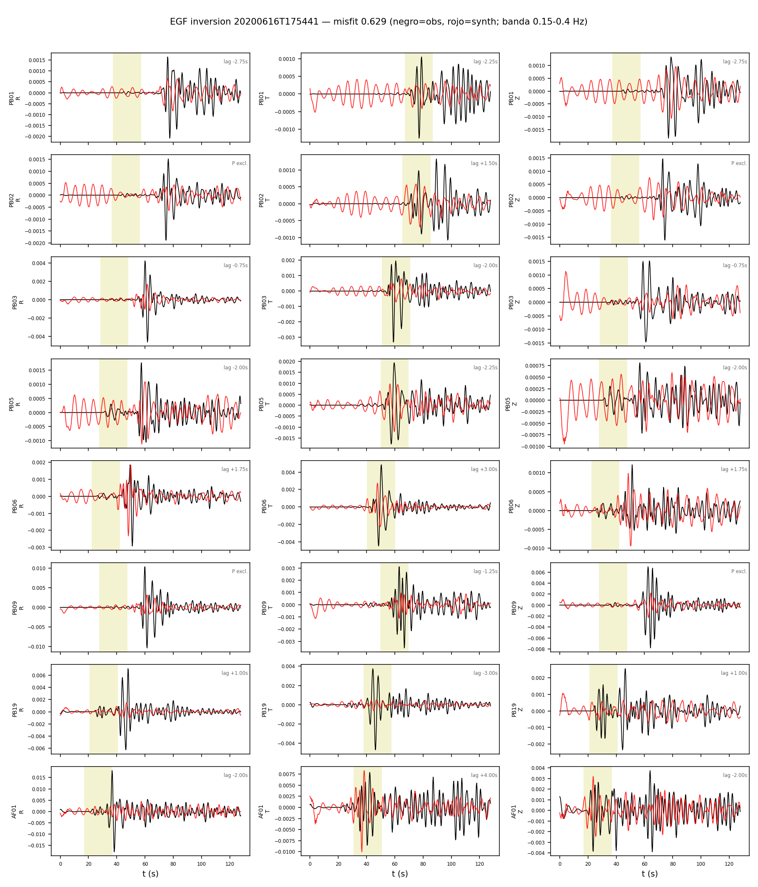
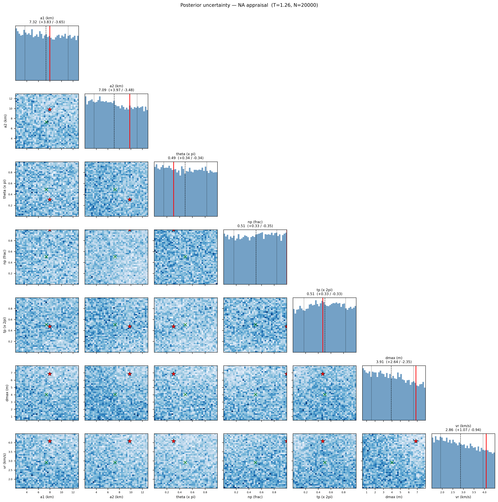

# Inversion EGF — Calama 2020 (banda 0.15-0.4 Hz)

EGF: 20200616T175441 M4.89 (M0_egf=2.43e+16 Nm, de Mw catalogo).
Estaciones (8): PB01, PB02, PB03, PB05, PB06, PB09, PB19, AF01

**Mejor misfit: 0.6292**  (M0=8.13e+19 Nm, Mw=7.24)

| param | valor |
|---|---|
| a1 (km) | 7.975 |
| a2 (km) | 9.800 |
| theta (x pi) | 0.304 |
| np (frac) | 1.000 |
| tp (x 2pi) | 0.473 |
| dmax (m) | 6.843 |
| vr (km/s) | 4.079 |
Lags estaticos (max +-4.0 s) del mejor modelo; ventanas P excluidas: PB02, PB09

| sta | lag P (s) | lag S (s) |
|---|---|---|
| PB01 | -2.75 | -2.25 |
| PB02 | -- | +1.50 |
| PB03 | -0.75 | -2.00 |
| PB05 | -2.00 | -2.25 |
| PB06 | +1.75 | +3.00 |
| PB09 | -- | -1.25 |
| PB19 | +1.00 | -3.00 |
| AF01 | -2.00 | +4.00 |

Notas: EGF alineada solo por dt de viaje S (taup); los lags de directividad quedan como senal. M0_egf incierto -> trade-off directo con dmax (geometria no afectada). P (R,Z) con CC moderada; la senal dominante es S (T).

