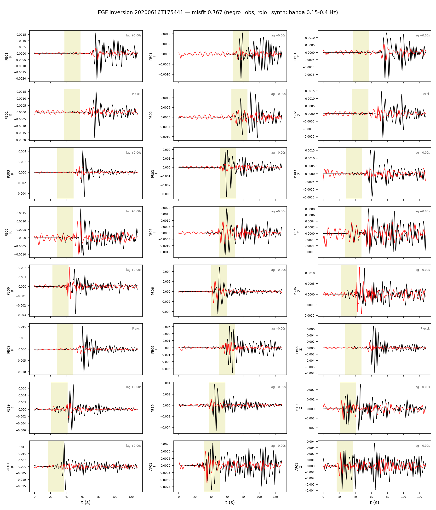
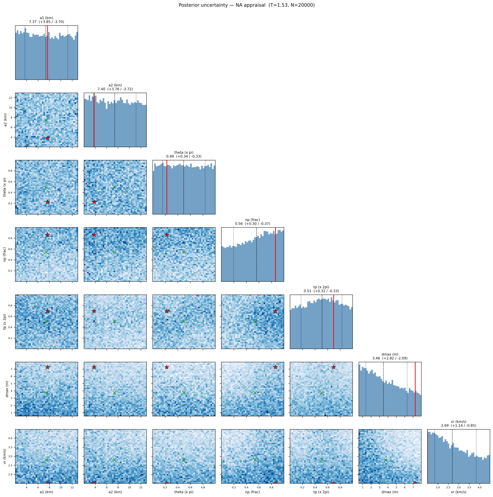

# Inversion EGF — Calama 2020 (banda 0.15-0.4 Hz)

EGF: 20200616T175441 M4.89 (M0_egf=2.43e+16 Nm, de Mw catalogo).
Estaciones (8): PB01, PB02, PB03, PB05, PB06, PB09, PB19, AF01

**Mejor misfit: 0.7668**  (M0=3.18e+19 Nm, Mw=6.97)

| param | valor |
|---|---|
| a1 (km) | 7.672 |
| a2 (km) | 3.818 |
| theta (x pi) | 0.226 |
| np (frac) | 0.862 |
| tp (x 2pi) | 0.695 |
| dmax (m) | 7.256 |
| vr (km/s) | 1.500 |

Notas: EGF alineada solo por dt de viaje S (taup); los lags de directividad quedan como senal. M0_egf incierto -> trade-off directo con dmax (geometria no afectada). P (R,Z) con CC moderada; la senal dominante es S (T).

