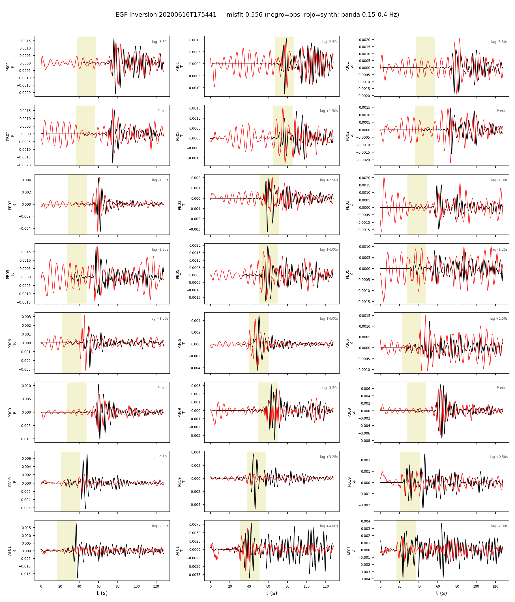
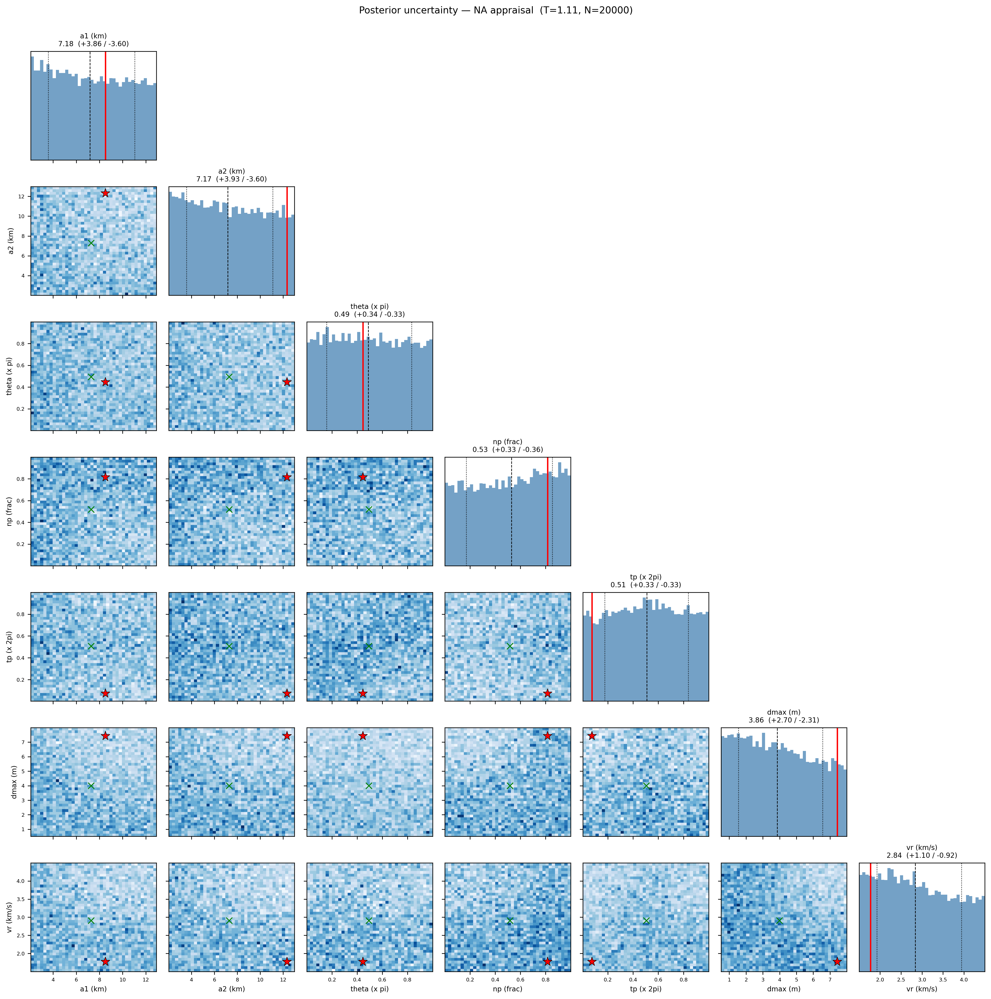

# Inversion EGF — Calama 2020 (banda 0.15-0.4 Hz)

EGF: 20200616T175441 M4.89 (M0_egf=2.43e+16 Nm, de Mw catalogo).
Estaciones (8): PB01, PB02, PB03, PB05, PB06, PB09, PB19, AF01

**Mejor misfit: 0.5562**  (M0=1.18e+20 Nm, Mw=7.35)

| param | valor |
|---|---|
| a1 (km) | 8.515 |
| a2 (km) | 12.327 |
| theta (x pi) | 0.446 |
| np (frac) | 0.816 |
| tp (x 2pi) | 0.074 |
| dmax (m) | 7.433 |
| vr (km/s) | 1.774 |
Lags estaticos (max +-4.0 s) del mejor modelo; ventanas P excluidas: PB02, PB09

| sta | lag P (s) | lag S (s) |
|---|---|---|
| PB01 | -3.50 | -2.50 |
| PB02 | -- | +1.50 |
| PB03 | -1.00 | +2.50 |
| PB05 | -1.25 | +4.00 |
| PB06 | +1.50 | +4.00 |
| PB09 | -- | -3.50 |
| PB19 | +0.50 | +3.25 |
| AF01 | -2.00 | +4.00 |

Notas: EGF alineada solo por dt de viaje S (taup); los lags de directividad quedan como senal. M0_egf incierto -> trade-off directo con dmax (geometria no afectada). P (R,Z) con CC moderada; la senal dominante es S (T).

