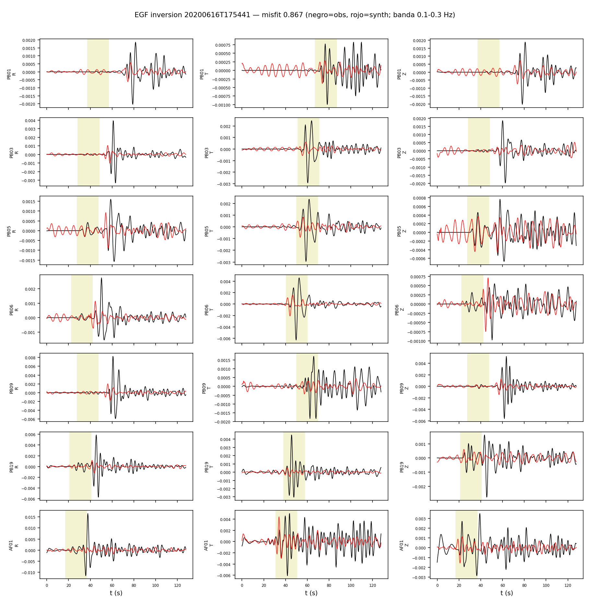
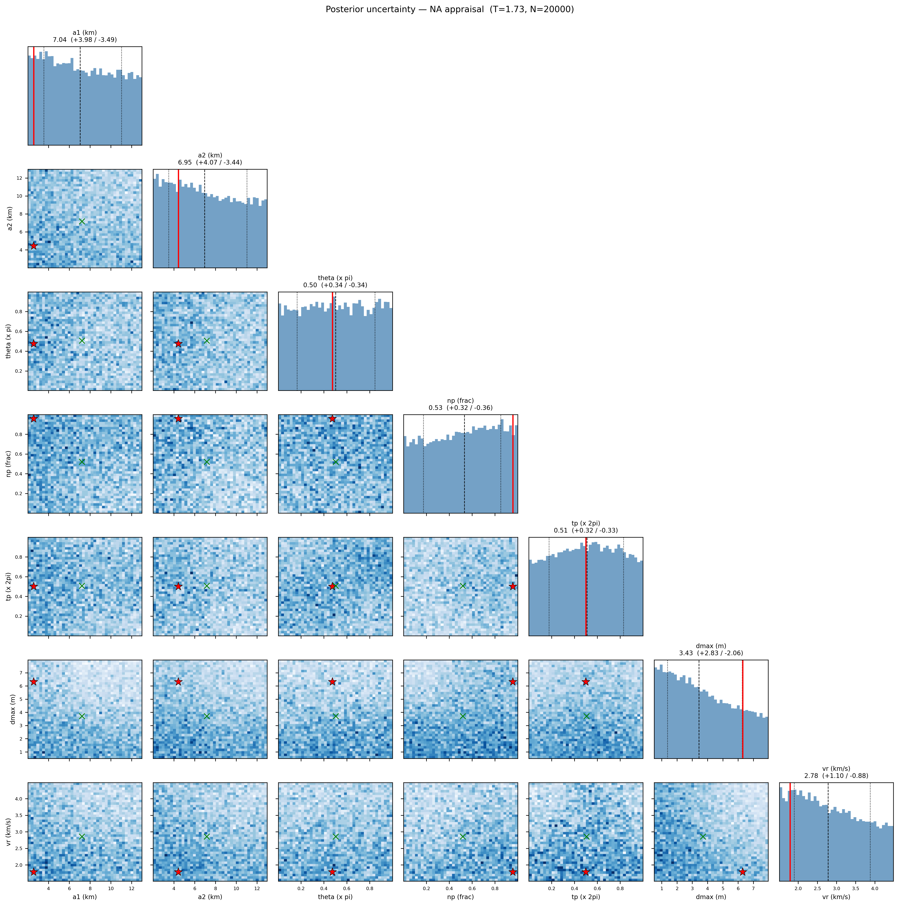

# Inversion EGF — Calama 2020 (banda 0.1-0.3 Hz)

EGF: 20200616T175441 M4.89 (M0_egf=2.43e+16 Nm, de Mw catalogo).
Estaciones (7): PB01, PB03, PB05, PB06, PB09, PB19, AF01

**Mejor misfit: 0.8665**  (M0=1.11e+19 Nm, Mw=6.66)

| param | valor |
|---|---|
| a1 (km) | 2.580 |
| a2 (km) | 4.445 |
| theta (x pi) | 0.475 |
| np (frac) | 0.958 |
| tp (x 2pi) | 0.501 |
| dmax (m) | 6.307 |
| vr (km/s) | 1.786 |

Notas: EGF alineada solo por dt de viaje S (taup); los lags de directividad quedan como senal. M0_egf incierto -> trade-off directo con dmax (geometria no afectada). P (R,Z) con CC moderada; la senal dominante es S (T).

