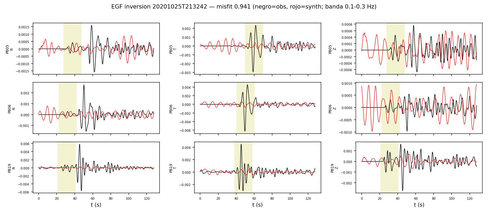
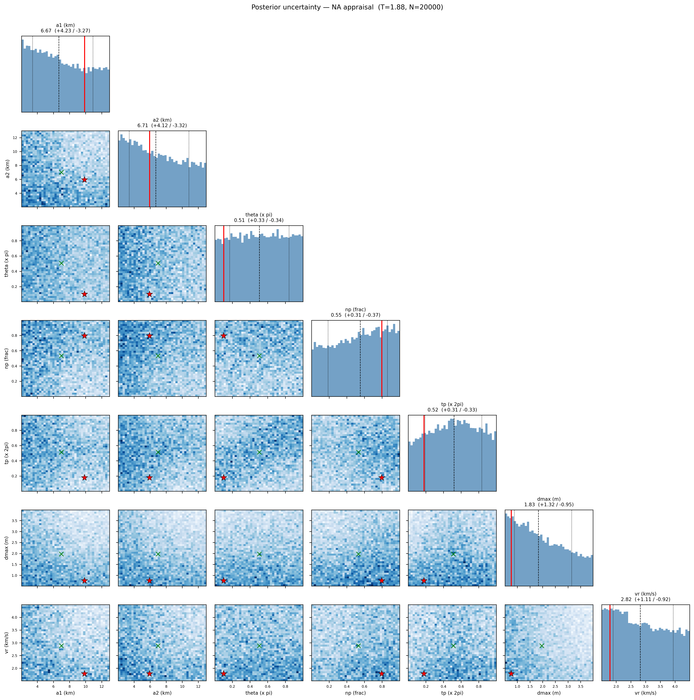

# Inversion EGF — Calama 2020 (banda 0.1-0.3 Hz)

EGF: 20201025T213242 M4.6 (M0_egf=8.91e+15 Nm, de Mw catalogo).
Estaciones (3): PB05, PB06, PB19

**Mejor misfit: 0.9406**  (M0=6.76e+18 Nm, Mw=6.52)

| param | valor |
|---|---|
| a1 (km) | 9.868 |
| a2 (km) | 5.937 |
| theta (x pi) | 0.102 |
| np (frac) | 0.796 |
| tp (x 2pi) | 0.179 |
| dmax (m) | 0.756 |
| vr (km/s) | 1.788 |

Notas: EGF alineada solo por dt de viaje S (taup); los lags de directividad quedan como senal. M0_egf incierto -> trade-off directo con dmax (geometria no afectada). P (R,Z) con CC moderada; la senal dominante es S (T).

