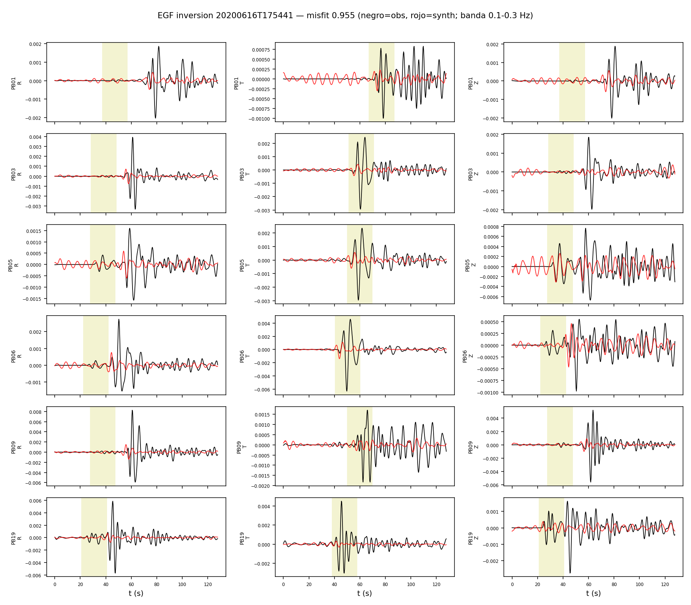
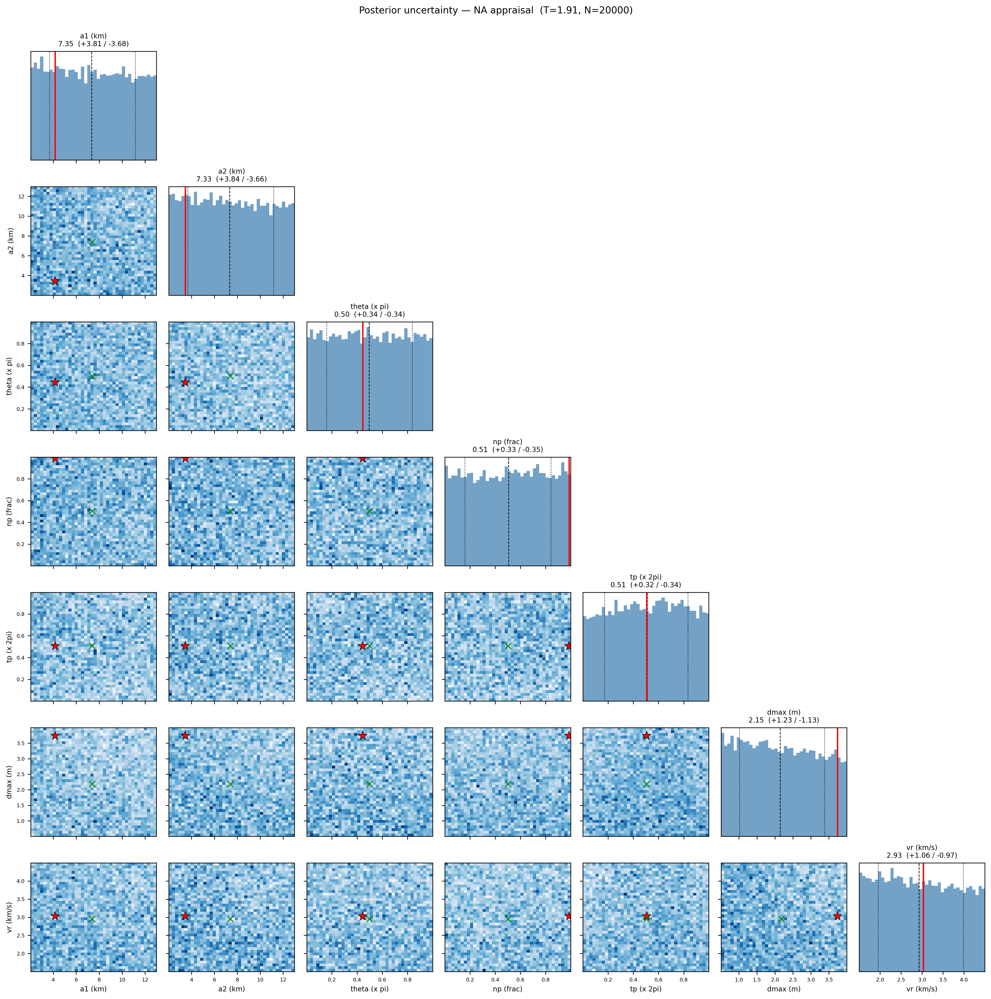

# Inversion EGF — Calama 2020 (banda 0.1-0.3 Hz)

EGF: 20200616T175441 M4.89 (M0_egf=2.43e+16 Nm, de Mw catalogo).
Estaciones (6): PB01, PB03, PB05, PB06, PB09, PB19

**Mejor misfit: 0.9546**  (M0=7.99e+18 Nm, Mw=6.57)

| param | valor |
|---|---|
| a1 (km) | 4.151 |
| a2 (km) | 3.453 |
| theta (x pi) | 0.445 |
| np (frac) | 0.988 |
| tp (x 2pi) | 0.506 |
| dmax (m) | 3.740 |
| vr (km/s) | 3.032 |

Notas: EGF alineada solo por dt de viaje S (taup); los lags de directividad quedan como senal. M0_egf incierto -> trade-off directo con dmax (geometria no afectada). P (R,Z) con CC moderada; la senal dominante es S (T).

