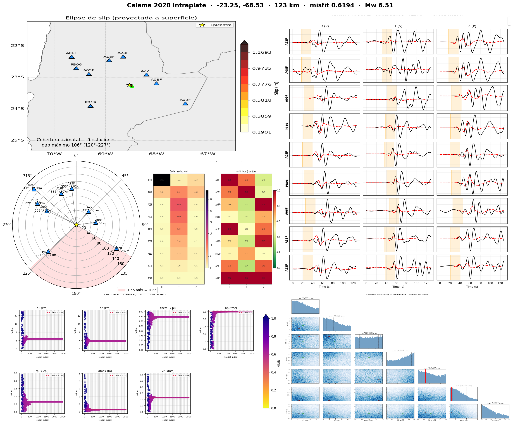
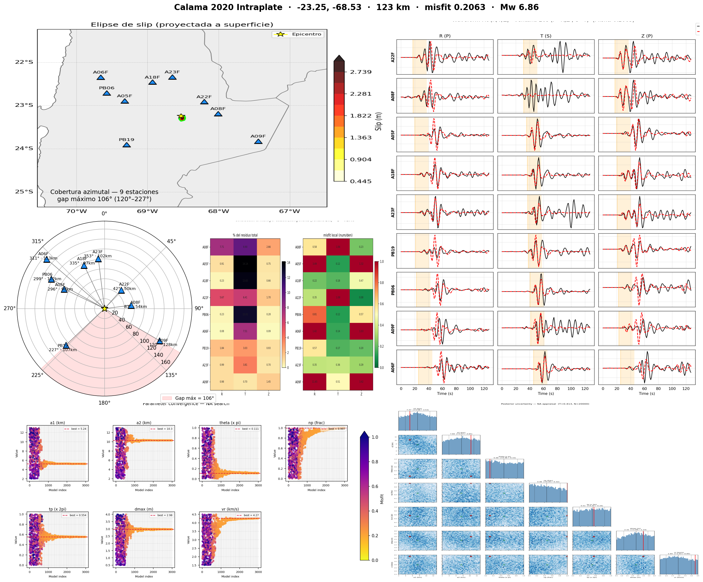
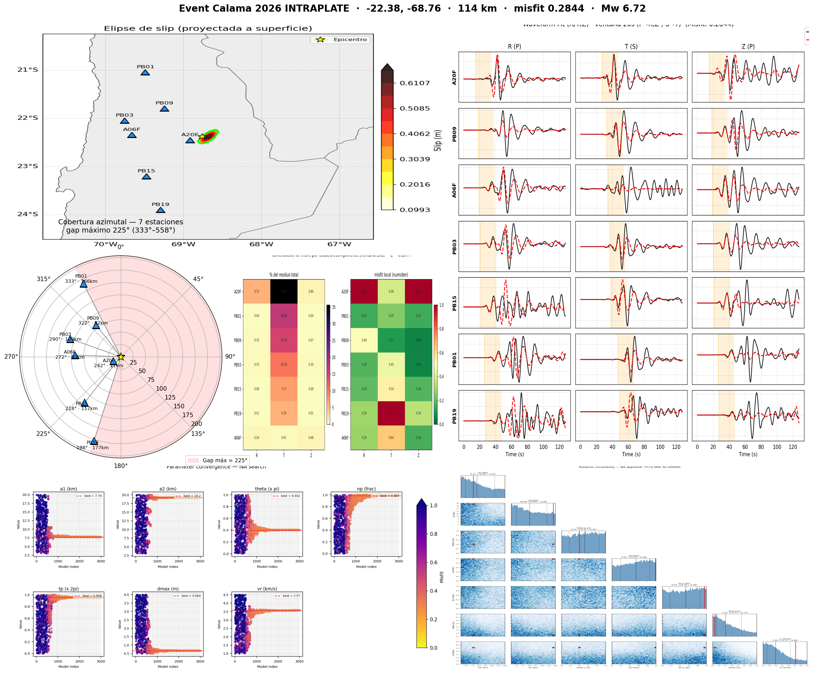

<!-- _class: lead -->
<!-- _paginate: false -->

# Reanálisis cinemático de rupturas intraslab en el norte de Chile

### Avances

Alex Villarroel · Doctorado en Geofísica

---

# Método

Inversión **cinemática** de aspereza elíptica sobre el plano de falla:

- **7 parámetros**: semiejes $a_1,a_2$, orientación $\theta$, posición del centro, instante de ruptura, deslizamiento máximo $d_{max}$, velocidad de ruptura $v_r$.
- Búsqueda global con **Neighbourhood Algorithm** (NA).
- **Misfit** L2 normalizado en ventanas P/S (P→Radial+Z, S→Transversal).
- Cuantificación de incertidumbre vía **appraisal** (NA 2ª etapa).

> Mismo pipeline aplicado a todos los eventos → comparación de igual a igual.

---

# Calama 2020 · legacy (validación)

Banda **0.02–0.1 Hz**, parámetros del paper (Herrera et al. 2023).

**Objetivo:** reproducir la ruptura publicada con mi pipeline.

➜ Confianza en el método.

---

# Calama 2020 · nueva (robustez)

Banda **0.06–0.15 Hz**, otras estaciones, datos en velocidad.

**Objetivo:** ¿depende la solución de la banda / estaciones?

➜ Misfit 0.21 (mejor ajuste que legacy).

---

# Calama 2026 · aplicación

Evento nuevo, mismo pipeline punto a punto.

---

# Copiapó 2025 · DC vs Full MT

**En curso** — comparación de dos parametrizaciones del tensor de momento:

- **Doble-cupla (DC):** run NA corriendo (`output_dc_z80`).
- **Full MT:** pendiente.

*(dashboards se agregan al terminar los runs)*

➜ Pregunta de investigación: ¿cuánto cambia la ruptura recuperada según la parametrización del MT?

---

# Comparación

| Evento | Banda (Hz) | #Est | Misfit | $a_1\times a_2$ (km) | $v_r$ (km/s) |
|---|---|---|---|---|---|
| Calama 2020 legacy | 0.02–0.1 | 9 | 0.62 | 6.4 × 5.9 | 1.64 |
| Calama 2020 nueva | 0.06–0.15 | 9 | 0.21 | 5.2 × 10.3 | 4.27 |
| Calama 2026 | 0.06–0.15 | 7 | 0.28 | 7.8 × 19.2 | 3.57 |
| Copiapó 2025 DC | — | — | *en curso* | — | — |
| Copiapó 2025 MT | — | — | *pendiente* | — | — |

---

# Próximos pasos

- Terminar **Copiapó** (DC + Full MT) y comparar.
- **EGF**: funciones de Green empíricas (Calama 2020, evento M4.9).
- Inversión **dinámica** (FD3D) como contraste.
- Redacción del **avance de tesis** (introducción + metodología ya escritas).
